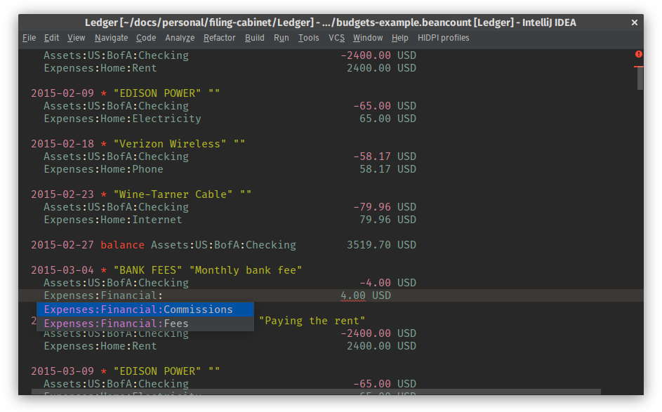

# Beancount plugin

This is a plugin that adds support for [Beancount][bc] to JetBrains IDEs.

Features:

* Syntax highlighting
* Completion: account names, currencies, directives
* Formatting

Roadmap:

* date completion
* bean-check execution
* bean-doctor execution
* inspection: transactions balance to 0

### Contributing

When importing the plugin source into intellij, use the gradle importer and be
sure to **uncheck** the create separate module per source set option, otherwise
the generated parser/lexer code will go into `src/` instead of `gen/`

### Developer notes

Many thanks to the plugin developers who came before and whose code served
as defacto documentation for the IntelliJ SDK. Their trail blazing makes this
possible.

* [go-lang-idea-plugin](https://github.com/go-lang-plugin-org/go-lang-idea-plugin)
* [intellij-elixir](https://github.com/KronicDeth/intellij-elixir)
* [elm-plugin](https://github.com/durkiewicz/elm-plugin)

That said, the Intellij docs are getting better. Here are a few crucial
resources for grokking the Intellij SDK.

**Grammar and Parsing**

Don't remember the grammar/parsing lectures from your compilers course?

* [The language of languages](http://matt.might.net/articles/grammars-bnf-ebnf/)
* [Pratt Parsers: Expression Parsing Made Easy](http://journal.stuffwithstuff.com/2011/03/19/pratt-parsers-expression-parsing-made-easy/)
* [Grammar-Kit](https://github.com/JetBrains/Grammar-Kit)
* [JFlex manual](http://jflex.de/manual.html)

**IDE features**

* [Custom Language Plugin](https://www.jetbrains.org/intellij/sdk/docs/reference_guide/custom_language_support.html)
* [What the Psi?](https://www.jetbrains.org/intellij/sdk/docs/basics/architectural_overview/psi.html)
* [Custom Project types](https://www.jetbrains.org/intellij/sdk/docs/reference_guide/project_model/project.html)
* [Testing plugins](https://www.jetbrains.org/intellij/sdk/docs/basics/testing_plugins.html)
* [More testing](https://www.jetbrains.org/intellij/sdk/docs/tutorials/writing_tests_for_plugins.html)

**Misc**

* [Other dev notes by Terence Parr](https://github.com/antlr/jetbrains/blob/master/doc/plugin-dev-notes.md)

## Copyright and License

Bean icon made by [Smashicons](https://www.flaticon.com/authors/smashicons)
from [www.flaticon.com](https://www.flaticon.com/) is licensed by
[CC 3.0 BY](http://creativecommons.org/licenses/by/3.0/)

Copyright (C) 2018 Casey Link

This program is free software; you can redistribute it and/or modify it under
the terms of the GNU General Public License as published by the Free Software
Foundation; either version 3 of the License, or (at your option) any later
version.

This program is distributed in the hope that it will be useful, but WITHOUT ANY
WARRANTY; without even the implied warranty of MERCHANTABILITY or FITNESS FOR A
PARTICULAR PURPOSE. See the GNU General Public License for more details.

You should have received a copy of the GNU General Public License along with
this program; if not, see <http://www.gnu.org/licenses>.

*Additional permission under GNU GPL version 3 section 7*

If you modify this Program, or any covered work, by linking or combining it
with Intellij IDEA Community Edition (or a modified version of that library),
containing parts covered by the terms of Apache v2.0, the licensors of this
Program grant you additional permission to convey the resulting work.
Corresponding Source for a non-source form of such a combination shall include
the source code for the parts of Intellij IDEA Community Edition used as well
as that of the covered work.

[bc]:http://furius.ca/beancount/
